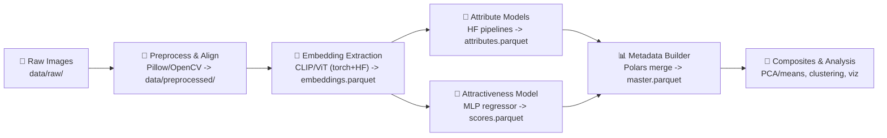

# 🧬 FaceStats v4.0 — Modern, Modular Face Analytics (PyTorch + HF)

FaceStats v4.0 is a cleaner, notebook-friendly refresh focused on **PyTorch + Hugging Face** components, fast parquet-first data plumbing, and lightweight composites/visuals.

- 🧹 Preprocessing with Pillow/OpenCV + optional Mediapipe alignment
- 🧠 CLIP/ViT embedding extraction (pure PyTorch/HF; no ONNX)
- 👥 Attribute inference (age/gender/ethnicity via HF pipelines)
- 💚 Attractiveness regression (small MLP on embeddings)
- 📊 Master metadata builder (Polars) + composites (mean/PCA)
- 🎨 Visualization notebooks for clustering and reporting
- 🧩 Modular scripts + notebooks; swap models easily

---

## 📦 Repository Structure (v4.0)

```
FaceStats/
├── config/                     # Configs/placeholders
├── data/                       # Raw/preprocessed/processed assets
│   ├── raw/                    # Input images
│   ├── preprocessed/           # Resized/aligned images
│   ├── processed/              # Parquet outputs (embeddings, attributes, master)
│   └── attributes|embeddings…  # Generated tables (varies by run)
├── models_insightface/         # Optional InsightFace assets
├── notebooks/                  # Stepwise pipelines (01–05)
│   ├── 01_preprocess.ipynb
│   ├── 02_embeddings.ipynb
│   ├── 03_attributes.ipynb
│   ├── 03_labels.ipynb
│   ├── 04_visualize_attributes.ipynb
│   └── 05_ethnicity_clusters.ipynb
├── src/                        # Library code
│   ├── attributes/             # Age/gender/ethnicity helpers
│   ├── composite/              # Composite generation
│   ├── data_utils/             # IO, filters, constants
│   ├── embeddings/             # CLIP/ViT embedding scripts
│   ├── metadata/               # Master table builder
│   ├── models/                 # Attractiveness model + training
│   ├── pipeline/               # Preprocess orchestration
│   └── visualization/          # Dashboards/apps (WIP)
├── requirements.txt
├── schematics.ipynb            # Diagrams + repo map
└── tools_summary.md            # Tooling snapshot with mermaid map
```

---

## 🧭 v4.0 Pipeline (Architecture)



---

## 🚀 Quickstart

1) Install deps: `pip install -r requirements.txt` (add `torch` CUDA build if you have GPU).  
2) Place raw images in `data/raw/`.  
3) Run notebooks in order:  
   - `01_preprocess.ipynb` → resized/aligned images in `data/preprocessed/`  
   - `02_embeddings.ipynb` → `embeddings.parquet`  
   - `03_attributes.ipynb` → `attributes.parquet` + optional labels  
   - `04_visualize_attributes.ipynb` / `05_ethnicity_clusters.ipynb` → analysis/plots  
4) Train/score attractiveness (optional): `src/models/train_attractiveness.py` then merge scores.  
5) Build master metadata: `src/metadata/build_master.py` (or notebook block).  
6) Generate composites: `src/composite/composite_generator.py` or run the notebook block.

---

## 🔍 Notable Changes vs v3.5

- Pure PyTorch + HF flow (no ONNX); simpler dependency stack.
- Attribute inference now leverages HF image-classification pipelines.
- Embeddings standardized to CLIP/ViT; parquet outputs by default.
- Metadata/composites handled via Polars and lightweight scripts/notebooks.
- Repo layout mirrors the stepwise notebooks for clarity and rapid iteration.

---

## 🧰 Tooling Snapshot

- Core: Python 3.x, `torch`, `transformers`, `polars`, `numpy`, `sklearn`, `Pillow`, `tqdm`
- Optional: `opencv-python`, Mediapipe FaceMesh (alignment), `matplotlib`/`seaborn`
- Artifacts: `embeddings.parquet`, `attributes.parquet`, `scores.parquet`, `master.parquet`

---

## 🗺️ Status

FaceStats v4.0 is the active iteration for research and experiments. Use this README as the landing page; see `tools_summary.md` and `schematics.ipynb` for diagrams and deeper maps.
