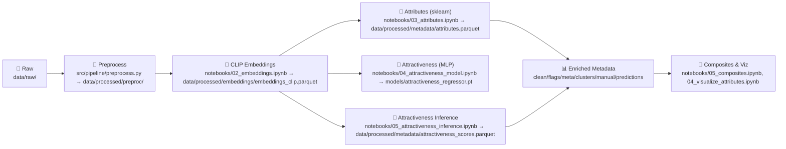
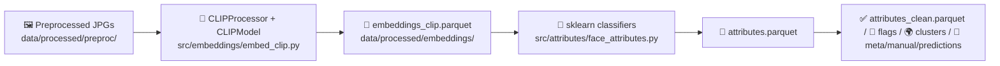
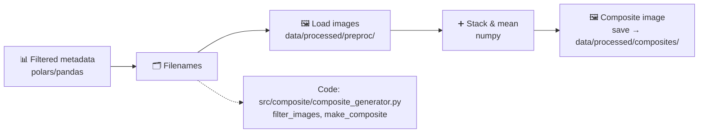

# 🧬 FaceStats v4.0 — CLIP-First Face Analytics

FaceStats is a CLIP-embedding-based pipeline for face metadata, scoring, and composites. It leans on PyTorch + 🤗 Transformers for embeddings, sklearn classifiers for attributes, polars (notebooks) for joins, and lightweight numpy/Pillow for composites.

- 🧠 CLIP embeddings → parquet
- 👥 Attribute inference (gender/ethnicity classifiers on embeddings)
- 💚 Attractiveness regression (MLP)
- 🎨 Composites and visualization notebooks
- 📊 Parquet-first data plumbing with polars/pandas

---

## 📂 Repository Layout (current)

```
FaceStats/
├── config/
├── data/
│   ├── raw/
│   │   └── fairface/
│   ├── processed/
│   │   ├── preproc/                     # resized/aligned JPGs
│   │   ├── embeddings/
│   │   │   └── embeddings_clip.parquet
│   │   ├── metadata/
│   │   │   ├── attributes.parquet, attributes_clean.parquet, attributes_final.parquet
│   │   │   ├── attributes_flags.parquet, attributes_with_clusters.parquet
│   │   │   ├── attributes_with_meta.parquet, attributes_with_manual.parquet, attributes_with_predictions.parquet
│   │   │   ├── attractiveness_scores.parquet, attractiveness_with_attributes.parquet
│   │   │   ├── fairface_label_structure.parquet, feature_index.json
│   │   │   └── labels_template.csv, manual_labels.csv
│   │   ├── composites/                  # e.g., composite_v4_example.jpg
│   │   └── attractiveness_scores.npy
│   ├── interim/
│   │   ├── checkpoints/
│   │   └── preprocessed/
│   ├── embeddings/
│   ├── models/
│   └── attributes/ (legacy)
├── models/                              # attractiveness_regressor.pt, gender_clf.pkl
├── models_insightface/
├── notebooks/
│   ├── 01_preprocess.ipynb
│   ├── 02_embeddings.ipynb
│   ├── 03_attributes.ipynb
│   ├── 04_visualize_attributes.ipynb
│   ├── 04_attractiveness_model.ipynb
│   ├── 05_attractiveness_inference.ipynb
│   ├── 05_ethnicity_clusters.ipynb
│   ├── 05_composites.ipynb
│   ├── 06_composites.ipynb
│   └── data/
├── src/
│   ├── pipeline/
│   ├── embeddings/
│   ├── attributes/
│   ├── models/
│   ├── composite/
│   ├── data_utils/
│   ├── learning/
│   ├── metadata/
│   └── visualization/
├── schematics.ipynb
├── schematics_4_0.ipynb
├── tools_summary.md
├── repo_map.md
├── requirements.txt
├── del.ipynb
└── x.ipynb
```

---

## 🧭 Pipeline Overview



---

## 🧠 Embeddings & Attributes



---

## 💚 Attractiveness Scoring


---

## 🎨 Composites



---

## 🚀 Quickstart

1) Install: `pip install -r requirements.txt` (pick the right `torch` build for your hardware).  
2) Drop raw images into `data/raw/`.  
3) Run notebooks in order:  
   - `01_preprocess.ipynb` → `data/processed/preproc/`  
   - `02_embeddings.ipynb` → `data/processed/embeddings/embeddings_clip.parquet`  
   - `03_attributes.ipynb` → `data/processed/metadata/attributes.parquet` (+ clean/flags/etc.)  
   - `04_attractiveness_model.ipynb` (train) → `models/attractiveness_regressor.pt`  
   - `05_attractiveness_inference.ipynb` → `data/processed/metadata/attractiveness_scores.parquet`  
   - `05_composites.ipynb` / `06_composites.ipynb` → composites in `data/processed/composites/`
4) Programmatic helpers: `src/attributes/face_attributes.py` (infer), `src/composite/composite_generator.py` (filter_images, make_composite), `src/embeddings/embed_clip.py` (get_clip_embedding).

---

## 🧰 Tooling

- Core: Python 3.x, `torch`, `transformers`, `numpy`, `sklearn`, `Pillow`, `tqdm`
- Notebook data plumbing: `polars` (optional install; falls back to pandas via to_pandas)
- Optional: `opencv-python`, Mediapipe FaceMesh, `matplotlib`/`seaborn`
- Artifacts: parquet everywhere (`embeddings_clip.parquet`, `attributes*.parquet`, `attractiveness_scores.parquet`), composites as JPGs

---

## 📝 Tool changes since last written

- Added `get_clip_embedding` to `src/embeddings/embed_clip.py` and updated `src/attributes/face_attributes.py` to use it (sklearn classifiers now consume CLIP embeddings).
- Swapped attribute inference to sklearn joblib classifiers; added safe label resolution and age placeholder.
- Exposed `filter_images` / `make_composite` in `src/composite/composite_generator.py` for notebook imports; composites save under `data/processed/composites/`.
- Documented `polars` as optional (not required for core helpers).
