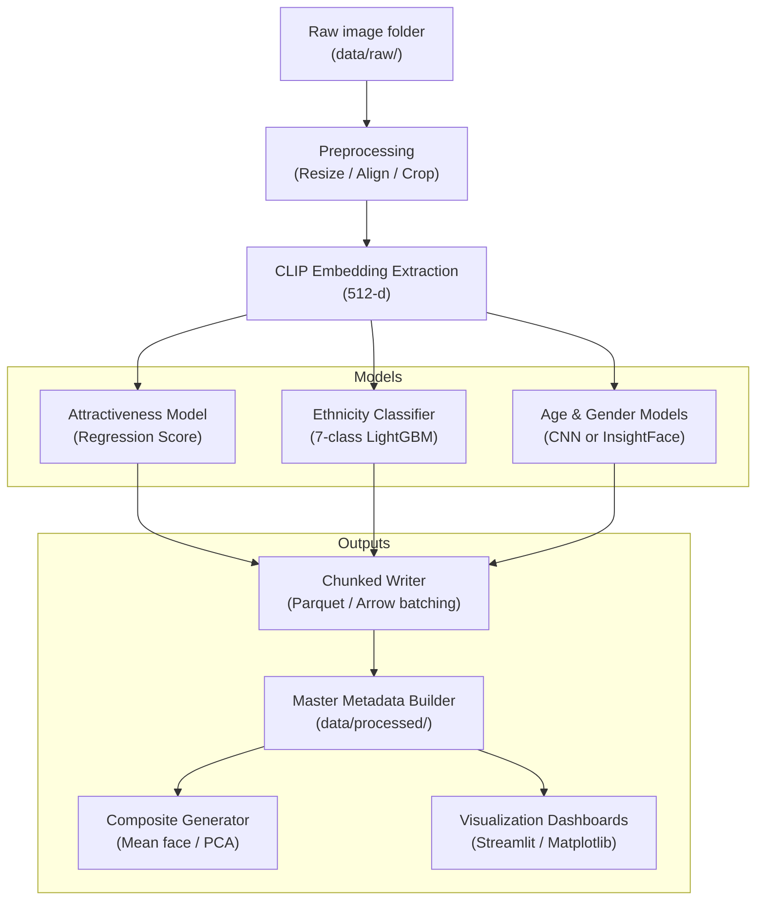

# 🧬 FaceStats v3.5 — Unified, GPU-Accelerated Pipeline for Face Analytics

FaceStats v3.5 is a **complete, production-grade pipeline** for large-scale face analytics, including:

- 🔍 **Image preprocessing & alignment**
- ✨ **CLIP embedding extraction**
- 💎 **Attractiveness scoring (regression model)**
- 🌎 **Ethnicity prediction (7-class classifier via LightGBM)**
- 🧠 **Demographic inference (age, gender)**
- 🖼️ **Composite face generation**
- 📊 **Interactive visualization tools**
- 🚀 **Fully unified pipeline (one pass, all metadata)**  
- 🔧 **Modular architecture for research & rapid experimentation**

FaceStats v3.5 is the recommended, stable, scalable version of the project.

---

## 📦 Repository Structure

```
FaceStats_v3.5/
│
├── config/
│   ├── pipeline_config.yaml
│   └── model_config.yaml
│
├── data/
│   ├── raw/                # Input images (uncurated)
│   ├── interim/            # Checkpoints, partial outputs
│   │   └── checkpoints/
│   └── processed/          # Final feature tables, embeddings, parquet files
│
├── src/
│   ├── pipeline/
│   │   └── fs00_unified_pipeline.py      # Main unified extraction pipeline
│   ├── training/
│   │   ├── train_attractiveness.py
│   │   ├── train_ethnicity.py
│   │   └── data_utils.py
│   ├── inference/
│   │   └── score_image.py                # Upload face → get score
│   └── visualization/
│       └── learning_curves.py
│
├── notebooks/
│   └── exploration_notebooks_here.ipynb
│
├── requirements.txt
├── .gitignore
└── README.md
```

---

## 🧭 Version 3.5 — Unified Pipeline (Architecture)



