# schematics-4-0 (FaceStats)

## Notebook → Code & Tools Map


## High-Level Pipeline

```mermaid
flowchart LR
    A["📁 Raw Images<br>data/raw/"] --> B["🧹 Preprocess<br>src/pipeline/preprocess.py → data/processed/preproc/"]
    B --> C["🧠 CLIP Embeddings<br>notebooks/02_embeddings.ipynb → data/processed/embeddings/embeddings_clip.parquet"]
    C --> D["👥 Attributes (sklearn)<br>notebooks/03_attributes.ipynb → data/processed/metadata/attributes.parquet"]
    C --> E["💚 Attractiveness Train<br>notebooks/04_attractiveness_model.ipynb → models/attractiveness_regressor.pt"]
    C --> F["🏃 Attractiveness Inference<br>notebooks/05_attractiveness_inference.ipynb → data/processed/metadata/attractiveness_scores.parquet"]
    D --> G["📊 Enriched Metadata<br>clean/flags/meta/clusters/manual/predictions"]
    F --> G
    G --> H["🎨 Composites & Viz<br>notebooks/05_composites.ipynb, 06_composites.ipynb"]
```


## Embeddings → Attributes

```mermaid
flowchart LR
    A["🖼️ Preprocessed JPGs<br>data/processed/preproc/"] --> B["🤗 CLIPProcessor + CLIPModel<br>src/embeddings/embed_clip.py"]
    B --> C["📄 embeddings_clip.parquet<br>data/processed/embeddings/"]
    C --> D["🎯 sklearn classifiers<br>src/attributes/face_attributes.py"]
    D --> E["📄 attributes.parquet"]
    E --> F["✅ attributes_clean.parquet / 🚩 flags / 🌍 clusters / 🔗 meta/manual/predictions"]
```


## Attractiveness Scoring


## Composites

```mermaid
flowchart LR
    A["📊 Filtered metadata<br>polars/pandas"] --> B["🗂️ Filenames"]
    B --> C["🖼️ Load images<br>data/processed/preproc/"]
    C --> D["➕ Stack & mean<br>numpy (see src/composite/composite_generator.py)"]
    D --> E["🖼️ Composite image<br>data/processed/composites/"]
```


## Repo Layout (current)
```text
FaceStats/
├── config/
├── data/
│   ├── raw/
│   │   └── fairface/
│   ├── processed/
│   │   ├── preproc/ (image outputs)
│   │   ├── embeddings/
│   │   │   └── embeddings_clip.parquet
│   │   ├── metadata/
│   │   │   ├── attributes.parquet
│   │   │   ├── attributes_clean.parquet
│   │   │   ├── attributes_final.parquet
│   │   │   ├── attributes_flags.parquet
│   │   │   ├── attributes_with_clusters.parquet
│   │   │   ├── attributes_with_meta.parquet
│   │   │   ├── attributes_with_manual.parquet
│   │   │   ├── attributes_with_predictions.parquet
│   │   │   ├── attractiveness_scores.parquet
│   │   │   ├── attractiveness_with_attributes.parquet
│   │   │   ├── fairface_label_structure.parquet
│   │   │   ├── feature_index.json
│   │   │   ├── labels_template.csv
│   │   │   └── manual_labels.csv
│   │   ├── composites/ (e.g., composite_v4_example.jpg)
│   │   └── attractiveness_scores.npy
│   ├── interim/
│   │   ├── checkpoints/
│   │   └── preprocessed/
│   ├── embeddings/
│   ├── models/
│   └── attributes/ (legacy)
├── models/
│   ├── attractiveness_regressor.pt
│   └── gender_clf.pkl
├── models_insightface/
├── notebooks/
│   ├── 01_preprocess.ipynb
│   ├── 02_embeddings.ipynb
│   ├── 03_attributes.ipynb
│   ├── 04_visualize_attributes.ipynb
│   ├── 04_attractiveness_model.ipynb
│   ├── 05_attractiveness_inference.ipynb
│   ├── 05_ethnicity_clusters.ipynb
│   ├── 05_composites.ipynb
│   ├── 06_composites.ipynb
│   └── data/
├── src/
│   ├── pipeline/
│   ├── embeddings/
│   ├── attributes/
│   ├── models/
│   ├── composite/
│   │   └── composite_generator.py
│   ├── data_utils/
│   ├── learning/
│   ├── metadata/
│   └── visualization/
├──current_files.md
├── LICENSE
├── README.md
├── requirements.txt
├── schematics_4_0.ipynb
├── schematics_4_0.md
└── tools_summary.md
```
