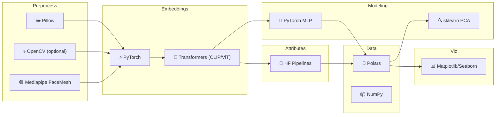

# ✨ FaceStats Tooling Snapshot

Quick, colorful glance at the stack powering preprocessing, embeddings, attributes, and reporting.

## 🌈 Core Libraries
- 🐍 Python 3.x with `requirements.txt`
- 🔥 `torch` + 🤗 `transformers` for CLIP/ViT embeddings + attribute models
- 🧮 `polars`, `numpy`, `sklearn` (PCA)
- 🖼️ `Pillow` (+ 🌀 `opencv-python` optional) for I/O, resizing, alignment helpers
- ⏱️ `tqdm` progress; 📊 `matplotlib`/`seaborn`; 🗒️ `nbformat` for notebook tweaks

## 🧭 Pipelines at a Glance
- 🧹 Preprocess: load → normalize → resize/alignment → `data/preprocessed/`
- 🧠 Embeddings: CLIP/ViT forward pass → L2 normalize → `embeddings.parquet`
- 👥 Attributes: HF image-classification pipelines → `attributes.parquet`
- 💚 Attractiveness: small MLP regressor → `scores.parquet`
- 📊 Metadata: merge embeddings/attributes/scores → `master.parquet`
- 🎨 Composites/Analysis: filter metadata, stack images, PCA/means, render composites/reports

## 🎛️ Tool Map (Mermaid)

## 📝 Notes
- 🖥️ CPU-first by default; plug in GPU-backed PyTorch if available.
- 🧩 No ONNX required; pure PyTorch + Transformers is the baseline.
- 🗂️ Keep paths consistent (`data/raw`, `data/preprocessed`, `embeddings.parquet`, `master.parquet`) to reuse notebooks without edits.
